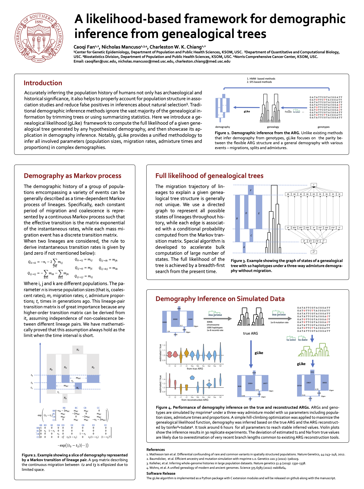

gLike
========

genealogical Likelihood (gLike) is a maximum likelihood method to infer the demographic history
of given populations that best explains the observed genealogical relationships between sample haplotypes. 
This is, to our knowledge, the first attempt to infer all types of parameters
(split times, admixture times and proportions, migration rates) in a complex demography model under a unified framework.

Installation
------------

download the package and install from local:

    git clone https://github.com/Ephraim-usc/sglike.git
    
    python3 -m pip install ./sglike

Full likelihood of genealogical trees
------------

Core functionality

    logp = glike.glike_trees(trees, demo)
    
Where `trees` is any enumerable that contains `tskit` genealogical trees.
And `demo` is the hypothesized Demography created manually or from provided models in `models.py`.
It returns the probability that such genealogical trees are generated under hypothesized demography.

Demography customization
------------

A Demography object is initialized with

    demo = glike.Demography()
    
And a number of discrete or continuous Phases are added into this Demography

    demo.add_phase(phase)

A continuous Phase is created by

    phase = glike.ContinuousPhase(t1, t2, Q, n)

Where `(t1, t2)` is the time interval, `Q` is the infinitesimal generator of the Markov process for a single lineage (i.e., migration rate matrix with negative diagonal elements so that row sums are zero), and `n` is the vector of coalescent rates.

A discrete Phase is created by

    phase = glike.DiscretePhase(t, P)

Where `t` is the time of the event, and `P` is the transition matrix.

When adding new Phases into Demogrpahy, the times and dimensions should match. Specifically, the `t1` or `t` of the newly added Phase should equal the `t2` or `t` of the last existing Phase, and the `Q.shape[0]` or `P.shape[0]` of the newly added Phase should match the `Q.shape[1]` or `P.shape[1]` of the last existing Phase.

To make a demographic model containing variable parameters, the idiom is

    def model(...):
      demo = glike.Demography()
      # add Phases that depend on the parameters
      return demo

Demography parameter estimation
------------

We provide an function for estimating parameters 

    glike.estimate(trees, model, search)

Which runs a smart maximum likelihood protocol specially designed for glike to find the estimated parameters.
We use a Search object to tell the information about initial values and restrictions of the parameters. It is created with

    search = Search(names, values, limits, fixed)

Where `names` is a list of the names of the parameters, `values` is a list of initial parameter values, `fixed` is a list of the names of fixed parameters so that their values will keep untouched. `limits` is a list of tuples `(low, high)` where `low` and `high` could be a number or the name of another parameter. For example, if our model has three events happening between 0 and 100 generations ago, in order to estimate the times of these three events we could do

    names = ["t1", "t2", "t3"]
    values = [25, 50, 75] # or other initial values you see fit
    limits = [(0, "t2"), ("t1", "t3"), ("t2", 100)]

Empirically, if the output parameters take values very close to the lower or upper limits, it's likely that the estimation is stuck in a local optimal, or the proposed model is not well compatible with the genealogical trees. If that's the case, it's suggested to try other initial values or demography models.

About this project
-------------

This is an ongoing project, please refer to our poster at ASHG 2022 for a brief introduction.

If you are interested in knowing more, please let us know. Email the author: caoqifan@usc.edu

