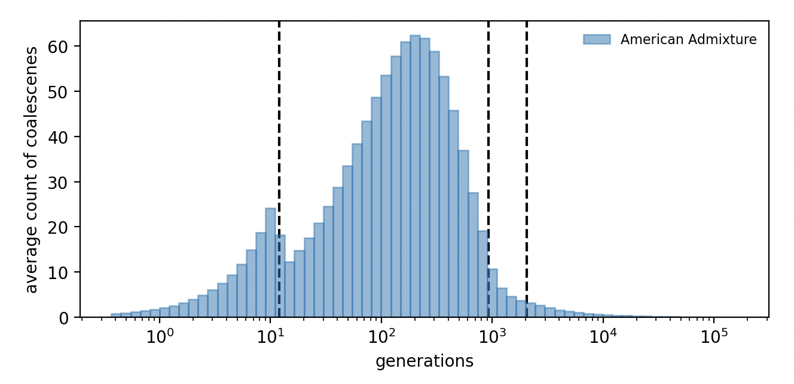
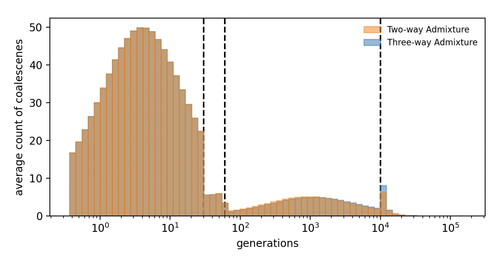

Tutorial
========

This is a toy example that replicates the experiment in Figure 2B of the paper.

Import necessary packages to go through this tutorial

    import numpy as np
    import msprime
    import glike

Simulating the ARG by msprime
------------

The three-way admixture model as defined in the msprime language is

    def threeway_admixture_demography(t1, t2, t3, r1, r2, N, N_a, N_b, N_c, N_d, N_e):
      demography = msprime.Demography()
      demography.add_population(name = "O", initial_size = N)
      demography.add_population(name = "A", initial_size = N_a)
      demography.add_population(name = "B", initial_size = N_b)
      demography.add_population(name = "C", initial_size = N_c)
      demography.add_population(name = "D", initial_size = N_d)
      demography.add_population(name = "E", initial_size = N_e)
      demography.add_admixture(time=t1, derived="O", ancestral=["A", "B"], proportions = [r1, 1-r1])
      demography.add_admixture(time=t2, derived="B", ancestral=["C", "D"], proportions = [r2, 1-r2])
      demography.add_population_split(time=t3, derived=["A", "C", "D"], ancestral="E")
      return demography

The true demography is created using the true parameters

    x_true = {"t1":30, "t2":60, "t3":1e4, "r1":0.4, "r2":0.7, "N":2000, "N_a":20000, "N_b":3000, "N_c":30000, "N_d":10000, "N_e":5000}
    demography = threeway_admixture_demography(**x_true)

We simulate 1000 haplotypes on a 30Mb chromosome and select 10 equally distant trees

    arg = msprime.sim_ancestry({"O": 1000}, sequence_length = 3e7, recombination_rate = 1e-8, demography = demography, ploidy = 1)
    trees = [arg.at(pos).copy() for pos in range(3000000, 30000000, 3000000)]

Defining the demographic model
------------

The three-way admixture model as defined in the glike language is

    def threeway_admixture_demo(t1, t2, t3, r1, r2, N, N_a, N_b, N_c, N_d, N_e):
      demo = glike.Demo()
      demo.add_phase(glike.Phase(0, t1, [1/N]))
      demo.add_phase(glike.Phase(t1, t2, [1/N_a, 1/N_b], P = np.array([[r1, 1-r1]])))
      demo.add_phase(glike.Phase(t2, t3, [1/N_a, 1/N_c, 1/N_d], P = np.array([[1, 0, 0], [0, r2, 1-r2]])))
      demo.add_phase(glike.Phase(t3, np.inf, [1/N_e], P = np.array([[1], [1], [1]])))
      return demo

Where the demography consists of four phases, each defined by the starting and ending time, the list of inverse population sizes, and the mass migration matrices.

Checking out the demography
------------

It is recommended to always check if the demographic model is written correctly. Here we create the true demography as an example:

    demo = threeway_admixture_demo(**x_true)
    demo.print()

The output is

    [phase from 0.0 to 30.0]
              A
    ns   0.0005
    grs  0.0000
    
    [phase from 30.0 to 60.0]
         A    B
    A  0.4  0.6
               A         B
    ns   0.00005  0.000333
    grs  0.00000  0.000000
    
    [phase from 60.0 to 10000.0]
         A    B    C
    A  1.0  0.0  0.0
    B  0.0  0.7  0.3
               A         B       C
    ns   0.00005  0.000033  0.0001
    grs  0.00000  0.000000  0.0000
    
    [phase from 10000.0 to inf]
       A
    A  1
    B  1
    C  1
              A
    ns   0.0002
    grs  0.0000

Which lists all phases in this demography. 
In each phase, the migration matrix -- if applicable -- is printed first.
Then the coalescence rates (i.e. inverse of population sizes) and growth rates are printed.
Note that because we did not specify names of the populations, alphabetical names (A, B, C, ...) are automatically created.

We can now play with gLike by

    glike.glike_trees(trees, demo)

Which outputs something like

    -80165.92668862805

This is the probability of `demo` to generate the genealogical trees in `trees`.
Feel free to change the parameters a bit and see how the likelihood changes (drops in most cases).

Estimating parameters
------------

gLike provides a function `maximize` that mimics the popular `scipy.optimize.minimize` function, but has been made convenient for optimizing demographic parameters. The most important grammatical difference is that `glike.maximize` works with named parameters. For example,

1. It accepts a dict for `x0` (rather than a 1D array), so that the function is called in the `fun(**x)` way.
2. It accepts string expressions containing parameter names in `bounds`, which will be interpreted by `eval` during runtime.

To use `glike.maximize` for parameter estimation, we need to first define a wrapper function, the initial values, and boundaries

    def fun(t1, t2, t3, r1, r2, N, N_a, N_b, N_c, N_d, N_e):
      demo = threeway_admixture_demo(t1, t2, t3, r1, r2, N, N_a, N_b, N_c, N_d, N_e)
      return glike.glike_trees(trees, demo)
    
    x0 = {"t1":10, "t2":20, "t3":5000.0, "r1":0.5, "r2":0.5, "N":10000, "N_a":10000, "N_b":10000, "N_c":10000, "N_d":10000, "N_e":10000}
    bounds = [(1, "t2"), ("t1", "t3"), ("t2", 1e5), (0.0,1.0), (0.0,1.0), (100,1000000), (100,1000000), (100,1000000), (100,1000000), (100,1000000), (100,1000000)]

Then running

    glike.maximize(fun, x0, bounds = bounds)

Would start the process of optimizing the function.
This usually takes around 2 hours on a personal computer.
When the function finishes, `x` will be the estimated parameters, and `logp` will be the maximum likelihood ever reached.
To reproduce Figure 2B of the paper, this process has to be repeated 50 times, and the estimates have to be averaged over the 50 replicates.
Find in [threeway admixture scripts](./paper/threeway_admixture) the scripts used on an SLURM cluster.

A more complicated example
------------

More advanced features (samples from mulitple pupulations, ancient DNA samples, the `kappa` parameter, etc.) can be demonstrated by replicating the experiment in Figure 5B of the paper.

gLike provides some demographic models (with default parameters hard-coded into them) in the `glike.models` module. In this example we will use them to avoid manually writting demographic models. The genealogcial trees under the Ancient European model can be simulated by

    demography = glike.ancient_europe_demography()
    samples_msprime = [msprime.SampleSet(20, population = "ana", time = 260),
               msprime.SampleSet(20, population = "neo", time = 180),
               msprime.SampleSet(20, population = "whg", time = 250),
               msprime.SampleSet(100, population = "bronze", time = 0),
               msprime.SampleSet(20, population = "yam", time = 160),
               msprime.SampleSet(20, population = "ehg", time = 250),
               msprime.SampleSet(20, population = "chg", time = 300)]
    arg = msprime.sim_ancestry(samples_msprime, sequence_length = 3e7, recombination_rate = 1e-8, demography = demography, ploidy = 1)
    trees = [arg.at(pos).copy() for pos in range(3000000, 30000000, 3000000)]

Note that samples are collected from different popuations at different times in history.
This information must be conveyed to gLike through the `samples` parameter constructed as

    tmp = ["ana"] * 20 + ["neo"] * 20 + ["whg"] * 20 + ["bronze"] * 100 + ["yam"] * 20 + ["ehg"] * 20 + ["chg"] * 20
    samples = {i:pop for i, pop in enumerate(tmp)}

Printing `samples` would give

    {0: 'ana', 1: 'ana', 2: 'ana', 3: 'ana', 4: 'ana', 5: 'ana', 6: 'ana', 7: 'ana', 8: 'ana', 9: 'ana', 10: 'ana', 11: 'ana', 12: 'ana', 13: 'ana', 14: 'ana', 15: 'ana', 16: 'ana', 17: 'ana', 18: 'ana', 19: 'ana', 20: 'neo', 21: 'neo', 22: 'neo', 23: 'neo', 24: 'neo', 25: 'neo', 26: 'neo', 27: 'neo', 28: 'neo', 29: 'neo', 30: 'neo', 31: 'neo', 32: 'neo', 33: 'neo', 34: 'neo', 35: 'neo', 36: 'neo', 37: 'neo', 38: 'neo', 39: 'neo', 40: 'whg', 41: 'whg', 42: 'whg', 43: 'whg', 44: 'whg', 45: 'whg', 46: 'whg', 47: 'whg', 48: 'whg', 49: 'whg', 50: 'whg', 51: 'whg', 52: 'whg', 53: 'whg', 54: 'whg', 55: 'whg', 56: 'whg', 57: 'whg', 58: 'whg', 59: 'whg', 60: 'bronze', 61: 'bronze', 62: 'bronze', 63: 'bronze', 64: 'bronze', 65: 'bronze', 66: 'bronze', 67: 'bronze', 68: 'bronze', 69: 'bronze', 70: 'bronze', 71: 'bronze', 72: 'bronze', 73: 'bronze', 74: 'bronze', 75: 'bronze', 76: 'bronze', 77: 'bronze', 78: 'bronze', 79: 'bronze', 80: 'bronze', 81: 'bronze', 82: 'bronze', 83: 'bronze', 84: 'bronze', 85: 'bronze', 86: 'bronze', 87: 'bronze', 88: 'bronze', 89: 'bronze', 90: 'bronze', 91: 'bronze', 92: 'bronze', 93: 'bronze', 94: 'bronze', 95: 'bronze', 96: 'bronze', 97: 'bronze', 98: 'bronze', 99: 'bronze', 100: 'bronze', 101: 'bronze', 102: 'bronze', 103: 'bronze', 104: 'bronze', 105: 'bronze', 106: 'bronze', 107: 'bronze', 108: 'bronze', 109: 'bronze', 110: 'bronze', 111: 'bronze', 112: 'bronze', 113: 'bronze', 114: 'bronze', 115: 'bronze', 116: 'bronze', 117: 'bronze', 118: 'bronze', 119: 'bronze', 120: 'bronze', 121: 'bronze', 122: 'bronze', 123: 'bronze', 124: 'bronze', 125: 'bronze', 126: 'bronze', 127: 'bronze', 128: 'bronze', 129: 'bronze', 130: 'bronze', 131: 'bronze', 132: 'bronze', 133: 'bronze', 134: 'bronze', 135: 'bronze', 136: 'bronze', 137: 'bronze', 138: 'bronze', 139: 'bronze', 140: 'bronze', 141: 'bronze', 142: 'bronze', 143: 'bronze', 144: 'bronze', 145: 'bronze', 146: 'bronze', 147: 'bronze', 148: 'bronze', 149: 'bronze', 150: 'bronze', 151: 'bronze', 152: 'bronze', 153: 'bronze', 154: 'bronze', 155: 'bronze', 156: 'bronze', 157: 'bronze', 158: 'bronze', 159: 'bronze', 160: 'yam', 161: 'yam', 162: 'yam', 163: 'yam', 164: 'yam', 165: 'yam', 166: 'yam', 167: 'yam', 168: 'yam', 169: 'yam', 170: 'yam', 171: 'yam', 172: 'yam', 173: 'yam', 174: 'yam', 175: 'yam', 176: 'yam', 177: 'yam', 178: 'yam', 179: 'yam', 180: 'ehg', 181: 'ehg', 182: 'ehg', 183: 'ehg', 184: 'ehg', 185: 'ehg', 186: 'ehg', 187: 'ehg', 188: 'ehg', 189: 'ehg', 190: 'ehg', 191: 'ehg', 192: 'ehg', 193: 'ehg', 194: 'ehg', 195: 'ehg', 196: 'ehg', 197: 'ehg', 198: 'ehg', 199: 'ehg', 200: 'chg', 201: 'chg', 202: 'chg', 203: 'chg', 204: 'chg', 205: 'chg', 206: 'chg', 207: 'chg', 208: 'chg', 209: 'chg', 210: 'chg', 211: 'chg', 212: 'chg', 213: 'chg', 214: 'chg', 215: 'chg', 216: 'chg', 217: 'chg', 218: 'chg', 219: 'chg'}

That denotes the population identities of specified lineages.

In this example, we demonstrate how to estimate some, but not all, of the demographic parameters. The wrapper function is now written as 

    def fun(t1 = 140, t2 = 180, t3 = 200, t4 = 600, t5 = 800, t6 = 1500, 
            r1 = 0.5, r2 = 0.5, r3 = 0.75, 
            N_ana = 50000, N_neo = 50000, N_whg = 10000, N_bronze = 50000, N_yam = 5000, N_ehg = 10000, N_chg = 10000, N_ne = 5000, N_wa = 5000, N_ooa = 5000, 
            gr = 0.067):
      demo = glike.ancient_europe_demo(t1, t2, t3, t4, t5, t6, r1, r2, r3, N_ana, N_neo, N_whg, N_bronze, N_yam, N_ehg, N_chg, N_ne, N_wa, N_ooa, gr)
      return glike.glike_trees(trees, demo, samples = samples, kappa = 3000)

Note that this function has default parameters, providing the flexibility that `x` will not be required to provide all parameter values.
Also note that here we use a slightly smaller `kappa` value to reduce computational time (at the cost of accuracy).

If we want to estimate only time parameters, we may do

    x0 = {"t1":120, "t2":170, "t3":190, "t4":500, "t5":600, "t6":1300}
    bounds = [(1, "t2"), ("t1", "t3"), ("t2", "t4"), ("t3", "t5"), ("t5", 10000)]
    glike.maximize(fun, x0, bounds = bounds)

If we want to estimate the population sizes and growth rates, we may do
    
    x0 = {"N_ana":10000, "N_neo":10000, "N_whg":10000, "N_bronze":10000, "N_yam":10000, "N_ehg":10000, "N_chg":10000, "N_ne":10000, "N_wa":10000, "N_ooa":10000, "gr":0.01}
    bounds = [(100,1000000), (100,1000000), (100,1000000), (100,1000000), (100,1000000), (100,1000000), (100,1000000), (100,1000000), (100,1000000), (100,1000000), (1e-4, 1e0)]
    glike.maximize(fun, x0, bounds = bounds)

Miscellaneous
------------

gLike provides some functionalities that may be helpful to users. 
For example, a `glike.Demo` object can be converted to an `msprime.Demography` object through the `glike.demo_to_demography` function.

    demo = glike.american_admixture_demo()
    demography = glike.demo_to_demography(demo)
    print(demography)

Which prints:

    Demography
    ╟  Populations
    ║  ┌────────────────────────────────────────────────────────────────────────────────────────────────┐
    ║  │ id │name   │description  │initial_size  │ growth_rate │  default_sampling_time│extra_metadata  │
    ║  ├────────────────────────────────────────────────────────────────────────────────────────────────┤
    ║  │ 0  │afr    │             │14474.0       │      0      │                      0│{}              │
    ║  │ 1  │eur    │             │34038.0       │   0.0038    │                      0│{}              │
    ║  │ 2  │asia   │             │45851.0       │   0.0048    │                      0│{}              │
    ║  │ 3  │admix  │             │54663.0       │    0.05     │                      0│{}              │
    ║  └────────────────────────────────────────────────────────────────────────────────────────────────┘
    ╟  Migration Matrix
    ║  ┌──────────────────────────────────┐
    ║  │       │ afr │ eur │ asia │ admix │
    ║  ├──────────────────────────────────┤
    ║  │    afr│  0  │  0  │  0   │   0   │
    ║  │    eur│  0  │  0  │  0   │   0   │
    ║  │   asia│  0  │  0  │  0   │   0   │
    ║  │  admix│  0  │  0  │  0   │   0   │
    ║  └──────────────────────────────────┘
    ╟  Events
    ║  ┌─────────────────────────────────────────────────────────────────────────────────────────┐
    ║  │  time│type            │parameters              │effect                                  │
    ║  ├─────────────────────────────────────────────────────────────────────────────────────────┤
    ║  │    12│Mass Migration  │source=admix,           │Lineages currently in population admix  │
    ║  │      │                │dest=afr,               │move to afr with probability 0.17       │
    ║  │      │                │proportion=0.17         │(equivalent to individuals migrating    │
    ║  │      │                │                        │from afr to admix forwards in time)     │
    ║  │┈┈┈┈┈┈┈┈┈┈┈┈┈┈┈┈┈┈┈┈┈┈┈┈┈┈┈┈┈┈┈┈┈┈┈┈┈┈┈┈┈┈┈┈┈┈┈┈┈┈┈┈┈┈┈┈┈┈┈┈┈┈┈┈┈┈┈┈┈┈┈┈┈┈┈┈┈┈┈┈┈┈┈┈┈┈┈┈┈│
    ║  │    12│Mass Migration  │source=admix,           │Lineages currently in population admix  │
    ║  │      │                │dest=eur,               │move to eur with probability 0.274      │
    ║  │      │                │proportion=0.274        │(equivalent to individuals migrating    │
    ║  │      │                │                        │from eur to admix forwards in time)     │
    ║  │┈┈┈┈┈┈┈┈┈┈┈┈┈┈┈┈┈┈┈┈┈┈┈┈┈┈┈┈┈┈┈┈┈┈┈┈┈┈┈┈┈┈┈┈┈┈┈┈┈┈┈┈┈┈┈┈┈┈┈┈┈┈┈┈┈┈┈┈┈┈┈┈┈┈┈┈┈┈┈┈┈┈┈┈┈┈┈┈┈│
    ║  │    12│Mass Migration  │source=admix,           │Lineages currently in population admix  │
    ║  │      │                │dest=asia,              │move to asia with probability 0.278     │
    ║  │      │                │proportion=0.278        │(equivalent to individuals migrating    │
    ║  │      │                │                        │from asia to admix forwards in time)    │
    ║  │┈┈┈┈┈┈┈┈┈┈┈┈┈┈┈┈┈┈┈┈┈┈┈┈┈┈┈┈┈┈┈┈┈┈┈┈┈┈┈┈┈┈┈┈┈┈┈┈┈┈┈┈┈┈┈┈┈┈┈┈┈┈┈┈┈┈┈┈┈┈┈┈┈┈┈┈┈┈┈┈┈┈┈┈┈┈┈┈┈│
    ║  │    12│Population      │population=afr,         │initial_size → 1.4e+04 and growth_rate  │
    ║  │      │parameter       │initial_size=14474.0,   │→ 0 for population afr                  │
    ║  │      │change          │growth_rate=0.0         │                                        │
    ...

Another useful feature is `glike.get_coalescent_times_demo`, which simulates the coalescence distribution of the `Demo` object.
For example,

    coals = glike.get_coals_demo(demo, {"admix":1000}, sims = 10000)

Simulates 10000 independent trees with the `msprime` engine, and summarizes the coalescent times.
The result is a 10000x999 2D array, each row of which is the coalescent times (a tree with 1000 samples has 999 coalescent events) of a simulated tree.
This coalescence distribution can be visualized by `glike.plot_coalescent_distribution`:

    import matplotlib as mpl
    import matplotlib.pyplot as plt
    import matplotlib.colors as mcolors
    
    fig = plt.figure(figsize = (7, 10))
    ax = fig.add_axes([0.1, 0.5, 0.4, 0.3])
    ax.axvline(x = 12, ymin = 0, ymax=1, linestyle = "dashed", color = "black", zorder = 1)
    ax.axvline(x = 920, ymin = 0, ymax=1, linestyle = "dashed", color = "black", zorder = 1)
    ax.axvline(x = 2040, ymin = 0, ymax=1, linestyle = "dashed", color = "black", zorder = 1)
    
    glike.plot_coalescent_distribution(ax, [coals], ["American Admixture"])
    plt.show()

Which plots:

It is worth noting that coalescence distributions are low-dimensional representations of the ARG, and may not capture all important features of the demography.
For example, the two-way admixture and three-way admixture demographies are almost indistinguishable by coalescence distributions:

    import matplotlib as mpl
    import matplotlib.pyplot as plt
    import matplotlib.colors as mcolors
    
    demo_threeway = glike.threeway_admixture_demo()
    demo_twoway = glike.threeway_admixture_demo(r2 = 1.0)
    
    coals_threeway = glike.get_coals_demo(demo_threeway, {"A":1000}, sims = 10000)
    coals_twoway = glike.get_coals_demo(demo_twoway, {"A":1000}, sims = 10000)
    
    fig = plt.figure(figsize = (7, 10))
    ax = fig.add_axes([0.1, 0.5, 0.4, 0.3])
    ax.axvline(x = 30, ymin = 0, ymax=1, linestyle = "dashed", color = "black", zorder = 1)
    ax.axvline(x = 60, ymin = 0, ymax=1, linestyle = "dashed", color = "black", zorder = 1)
    ax.axvline(x = 10000, ymin = 0, ymax=1, linestyle = "dashed", color = "black", zorder = 1)
    
    glike.plot_coalescent_distribution(ax, 
        [coals_threeway, coals_twoway], 
        ["Three-way Admixture", "Two-way Admixture"])
    
    plt.show()

Note that `glike.demo_to_demography` and `glike.get_coalescent_times_demo` are based on `msprime` version 1.0, and may not be compatible with future updates of `msprime`.

